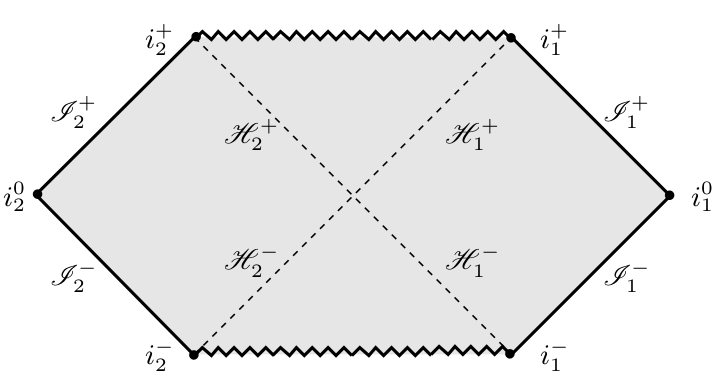

# Página personal

¡Hola a todes! Soy Edgar Gasperín, investigador en Relatividad General y a partir de enero de 2026 me incorporaré al Instituto de Ciencias Nucleares de la UNAM.  

Si estudias Física o Matemáticas y te interesa la Relatividad, aquí encontrarás información sobre mi investigación, cursos y oportunidades de tesis y servicio social.

<!-- ============================ -->
<!-- ¿Qué es la Relatividad Matemática? -->
<!-- ============================ -->

  
<strong>¿Qué es la Relatividad Matemática?</strong>

La Relatividad General es la teoría que explica la gravedad como una manifestación de la geometría del espacio-tiempo. Más que un pilar de la física moderna, es considerada por muchos como un estandarte de las matemáticas aplicadas.  

Las ecuaciones que describen el espacio-tiempo son las ecuaciones de Einstein, un sistema de ecuaciones diferenciales parciales no lineales. Una forma natural de dividir las ramas de la Relatividad es preguntarse: ¿cómo se pueden resolver estas ecuaciones?

Al inicio, se encontraron soluciones exactas que nos enseñaron muchísimo, pero eran válidas solo en casos muy simplificados con muchas simetrías. Para abordar situaciones más complejas y realistas hay dos caminos: hacer aproximaciones o estudiar propiedades abstractas de las soluciones mediante teoremas.

En cuanto a "aproximaciones" (entre comillas porque los resultados son extremadamente precisos), podemos usar métodos numéricos, lo que da origen a la Relatividad Numérica, o simplificar las ecuaciones, por ejemplo mediante su linearización, que conduce a la teoría de perturbaciones lineales. Ambas áreas son hoy fundamentales para estudiar ondas gravitacionales. 

Por otro lado, la Relatividad Matemática se dedica al estudio abstracto de las soluciones de las ecuaciones de Einstein, combinando geometría diferencial y teoría de ecuaciones diferenciales parciales. Si quieres consultar un artículo sobre los resultados clave de la Relatividad Matemática en el estudio de las ondas gravitacionales, haz clic aquí: <a href="https://www.ams.org/publications/journals/notices/201707/rnoti-p684.pdf">GWmaths</a>.

Todas estas áreas no están aisladas sino que se complementan entre sí para entender a fondo el comportamiento de las soluciones de esta teoría centenaria.

<!-- ============================ -->
<!-- ¿De qué trata mi investigación? -->
<!-- ============================ -->

  
<strong>¿De qué trata mi investigación?</strong>

Mi investigación se centra en la <strong>región en infinito</strong> del espacio-tiempo.  
En Relatividad General, existen distintos tipos de infinito:  
- <strong>infinito espacial</strong> (muy, muy lejos),  
- <strong>infinito temporal</strong> (muy temprano o muy tardío),  
- <strong>infinito nulo</strong> ( $\infty$ para fotones).  

Esta región se llama <strong>frontera conforme</strong>. Utilizo técnicas geométricas y de ecuaciones diferenciales parciales para entender estas zonas del espacio-tiempo. Además, colaboro con relativistas numéricos para estudiar la frontera conforme mediante formulaciones de las ecuaciones de Einstein que permitan acceder a estas regiones “en el infinito”.

<!-- ============================ -->
<!-- Al infinito y más allá -->
<!-- ============================ -->

  
<strong>Al infinito y más allá</strong>

El concepto de infinito ha sido fundamental en la historia de la física y las matemáticas. ¡Sin él, no existiría el cálculo diferencial!  
Aunque está “muy lejos”, el infinito no es solo un concepto abstracto: es clave para definir cantidades físicas como la masa o la radiación gravitacional (ondas gravitacionales).  

En cursos de geometría o cálculo probablemente hayas visto la versión Riemanniana de la frontera conforme: en la proyección estereográfica, el infinito del plano se mapea a un polo de la esfera. En Relatividad General, el infinito es más que un punto: es una variedad, lo que nos permite, por ejemplo, “hacer geometría en infinito”. Otro ejemplo clásico es la geometría hiperbólica del disco de Poincaré, ilustrado en los trabajos de M. C. Escher:

  

<small> Imagen tomada de la página web <a href="https://escherinhetpaleis.nl/en/about-escher/escher-today/circle-limit-iv-heaven-and-hell">Escher in Het Paleis</a> </small>

 

En ‘Circle Limit IV’ o ‘Heaven and Hell’ Escher muestra como se vería un mosaico (plano) de ángeles y demonios representados en el disco de Poincaré; los ángeles y demonios en la orilla del círculo están en "infinito".

De manera análoga en Relatividad tenemos los diagramas de Penrose–Carter que nos permiten “comprimir” la extensión infinita del espacio-tiempo en un solo dibujo. Por ejemplo, la siguiente figura representa un espacio-tiempo que contiene un agujero negro:

  

<small> Imagen tomada del libro <a href="https://doi.org/10.1017/9781009291309">conformal-methods</a> </small>

 

En ese diagrama se representa infinito espacial ($i^0$), temporal ($i^\pm$) y nulo ($\mathscr{I}^{\pm}$), así como los horizontes ($\mathcal{H}^\pm$) y la singularidad (zig-zag) para el espacio-tiempo de Schwarzschild.

<!-- ============================ -->
<!-- Temas de tesis y servicio social -->
<!-- ============================ -->

  
<strong>Temas de tesis y servicio social</strong>

Si quieres realizar una tesis o servicio social en alguno de estos temas, no dudes en contactarme al correo:

e[dot]gasperin[at]ciencias[dot]unam[dot]mx

<!-- ============================ -->
<!-- Curso Relatividad -->
<!-- ============================ -->

  
<strong>Curso de Relatividad en la Facultad de Ciencias (2026)</strong>

En febrero de 2026 impartiré un curso de Relatividad en la Facultad de Ciencias de la UNAM.  
Será un curso presencial, usando el pizarrón y siguiendo el temario oficial, pero incluirá un <strong>taller introductorio de xAct en Mathematica</strong>, una herramienta de cálculo simbólico que uso cotidianamente en mi investigación para cálculos tensoriales. xAct no es una herramienta numérica, sino de álgebra simbólica, y permite realizar cálculos tensoriales de manera eficiente.

Para conocer algunas versiones extendidas del taller, consulta: <a href="https://edgargasperin.github.io/xact-workshop/">xAct</a>.

<!-- ============================ -->
<!-- Trayectoria -->
<!-- ============================ -->

  
<strong>Trayectoria</strong>

Puedes consultar mi CV en el siguiente link: <a href="https://edgargasperin.github.io/">CV</a>.

<!-- ============================ -->
<!-- Publicaciones -->
<!-- ============================ -->

  
<strong>Publicaciones</strong>

Para saber más sobre mi investigación puedes consultar mis artículos aquí:

 
<a href="https://orcid.org/0000-0003-1170-5121">ORCID</a>  
<a href="https://arxiv.org/search/?searchtype=author&query=Gasperin%2C+E">ArXiv</a>

<!-- ============================ -->
<!-- Charlas -->
<!-- ============================ -->

  
<strong>Charlas de investigación</strong>

Algunas de mis charlas de investigación grabadas se pueden encontrar aquí:

 
<a href="https://www.youtube.com/watch?v=yRD__WXVqN0&list=PLg7f-TkW11iX-bN_5mnvWGBdrw5ljfC8X">Video - Royal Society London</a>  
<a href="https://www.youtube.com/watch?v=E18QPZD0rsw&t=963s">Video - CENTRA seminar Lisbon</a>  
<a href="https://www.facebook.com/matefcienciasunam/videos/333825669643721/">Video F-Ciencias UNAM</a>

<!-- ============================ -->
<!-- Divulgación -->
<!-- ============================ -->

  
<strong>Divulgación</strong>

Charla de divulgación en la Agencia Espacial Mexicana (México)  
<a href="https://www.gob.mx/aem/videos/seminario-agujeros-negros-y-efectos-relativistas-en-viajes-espaciales-parte-i">Video</a>

  
Entrevista en la Agencia Espacial Mexicana (México)  
<a href="http://haciaelespacio.aem.gob.mx/revistadigital/articul.php?interior=989">Video</a>

  
Participación en Radio UNAM (México)  
<a href="https://www.radiopodcast.unam.mx/podcast/audio/18778">website</a>

  
Charla de divulgación en el Planetario de Orizaba (México).  
 
Charla de divulgación en Pint of Science (Londres).  
 
Charla de divulgación en NAPE skills factory (Lisboa).  
 
Charla en VIII Jornadas de Engenharia Física en IST (Lisboa).  
 
Mesa redonda en VIII Jornadas de Engenharia Física en IST (Lisboa).  
<a href="https://www.youtube.com/watch?v=YA02G94OeV0">Video</a>

